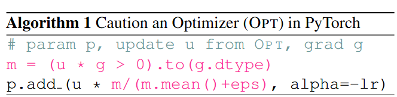
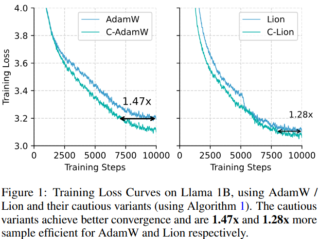

---

# Cautious Optimizer (C-Optiom): Improving Training with One Line of Code
AdamW has long been the go-to optimizer for transformer pretraining. For years, the research community has been searching for faster and more stable optimizers, with a focus on achieving only positive outcomes. In this work, we introduce a simple, single-line modification in PyTorch for any momentum-based optimizer. This modification, termed **Cautious Optimizer** (e.g., **C-AdamW** and **C-Lion**), opens the door to improved training performance.

Our theoretical findings reveal that this modification preserves Adam’s Hamiltonian function and retains its convergence guarantees under Lyapunov analysis. Additionally, a new family of optimizers emerges from this insight. Among these, we select the simplest for empirical experiments, achieving up to **1.47x speed-up** on **Llama** and **MAE pretraining**.

---

## 🌟 News
- **[2024-11-24]** Pre-release paper available on arXiv: [Cautious Optimizers: Improving Training with One Line of Code](https://arxiv.org/abs/2411.16085).
- **[2024-11-24]** Official implementation of C-Optim released! Experiment with C-AdamW and C-Lion today.

---

## 🚀 Implementation

### Generic Single-Line Implementation for C-Optim
<div align="center">
  
</div>

### Empirical Results
<div align="center">
  
</div>
---

## 📦 Installation
### Install Experiment Dependencies
```bash
pip install -r requirements.txt
```

---

## 🛠️ Usage
### Pretraining Llama on C4
```bash
torchrun --standalone --nproc_per_node 1 torchrun_main.py \
         --model_config configs/llama_60m.json \
         --lr 0.001 \
         --batch_size 16 \
         --total_batch_size 512 \
         --activation_checkpointing \
         --num_training_steps 10000 \
         --warmup_steps 1000 \
         --weight_decay 0 \
         --grad_clipping 1.0 \
         --dtype bfloat16 \
         --eval_every 1000 \
         --single_gpu \
         --optimizer c-adamw \
         --max_length 1024
```

### Pretraining MAE on ImageNet 1K (50 Epochs)
```bash
torchrun --standalone --nproc_per_node 4 run_mae.py \
    --dataset_name ILSVRC/imagenet-1k \
    --output_dir ./vit-mae-c \
    --remove_unused_columns False \
    --label_names pixel_values \
    --mask_ratio 0.75 \
    --norm_pix_loss \
    --do_train \
    --do_eval \
    --base_learning_rate 1.5e-4 \
    --lr_scheduler_type cosine \
    --weight_decay 0.05 \
    --num_train_epochs 50 \
    --warmup_ratio 0.05 \
    --per_device_train_batch_size 256 \
    --per_device_eval_batch_size 8 \
    --logging_strategy steps \
    --logging_steps 10 \
    --eval_strategy epoch \
    --save_strategy epoch \
    --load_best_model_at_end True \
    --save_total_limit 3 \
    --seed 1337 \
    --custom_optim c-adamw \
    --trust_remote_code \
    --gradient_accumulation_steps 4
```

---

## 📖 Citation
```bibtex
@misc{liang2024online,
      title={Cautious Optimizers: Improving Training with One Line of Code}, 
      author={Kaizhao Liang and Lizhang Chen and Bo Liu and Qiang Liu},
      year={2024},
      eprint={https://arxiv.org/abs/2411.16085},
      archivePrefix={arXiv},
      primaryClass={cs.LG}
}
```

--- 
