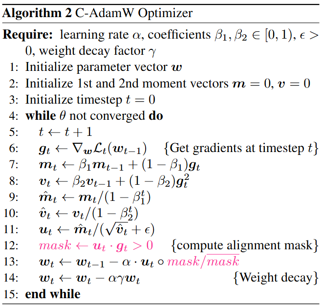

# Cautious Optimizer (C-Optiom): Improving Training with One Line of Code
AdamW has been the default optimizer for transformer pretraining. For many years, our community searches for faster and more stable optimizers with only constraint positive outcomes. In this work, we propose a single-line modification in Pytorch to any momentum-based optimizer, which we rename Cautious Optimizer, e.g. C-AdamW and C-Lion. Our theoretical result shows that this modification preserves Adam’s Hamiltonian function and it does not break the convergence guarantee under the Lyapunov analysis. In addition, a whole new family of optimizers is revealed by our theoretical insight. Among them, we pick the simplest one for empirical experiments, showing speed-up on Llama and MAE pretraining up to 1.47×.

<div align="center">
  
</div>

## Implementation
### Generic single line implementation for C-Optim
<div align="center">
  
</div>

### Pesudo Code for C-AdamW
<div align="center">
  
</div>

## Installation
### Install experiment dependencies

```bash
pip install -r requirements.txt
```

## Usage
Example command for pretraining llama on C4
```
torchrun --standalone --nproc_per_node 1 torchrun_main.py \
         --model_config configs/llama_60m.json \
         --lr 0.001 \
         --batch_size 16 \
         --total_batch_size 512 \
         --activation_checkpointing \
         --num_training_steps 10000 \
         --warmup_steps 1000 \
         --weight_decay 0 \
         --grad_clipping 1.0 \
         --dtype bfloat16 \
         --eval_every 1000 \
         --single_gpu \
         --optimizer c-adamw \
         --max_length 1024
```

Example command for pretraining MAE on ImageNet 1K for 50 epochs
```
torchrun --standalone --nproc_per_node 4 run_mae.py \
    --dataset_name ILSVRC/imagenet-1k \
    --output_dir ./vit-mae-c \
    --remove_unused_columns False \
    --label_names pixel_values \
    --mask_ratio 0.75 \
    --norm_pix_loss \
    --do_train \
    --do_eval \
    --base_learning_rate 1.5e-4 \
    --lr_scheduler_type cosine \
    --weight_decay 0.05 \
    --num_train_epochs 50 \
    --warmup_ratio 0.05 \
    --per_device_train_batch_size 256 \
    --per_device_eval_batch_size 8 \
    --logging_strategy steps \
    --logging_steps 10 \
    --eval_strategy epoch \
    --save_strategy epoch \
    --load_best_model_at_end True \
    --save_total_limit 3 \
    --seed 1337 \
    --custom_optim c-adamw \
    --trust_remote_code \
    --gradient_accumulation_steps 4
```
## Citation
```bibtex
@misc{liang2024online,
      title={Cautious Optimizers: Improving Training with One Line of Code}, 
      author={Kaizhao Liang and Lizhang Chen and Bo Liu and Qiang Liu},
      year={2024},
      eprint={https://arxiv.org/abs/2411.16085},
      archivePrefix={arXiv},
      primaryClass={cs.LG}
}
```
